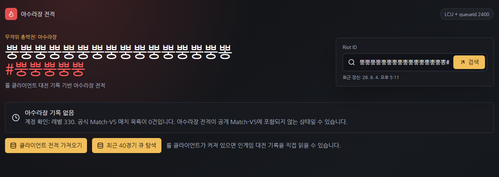
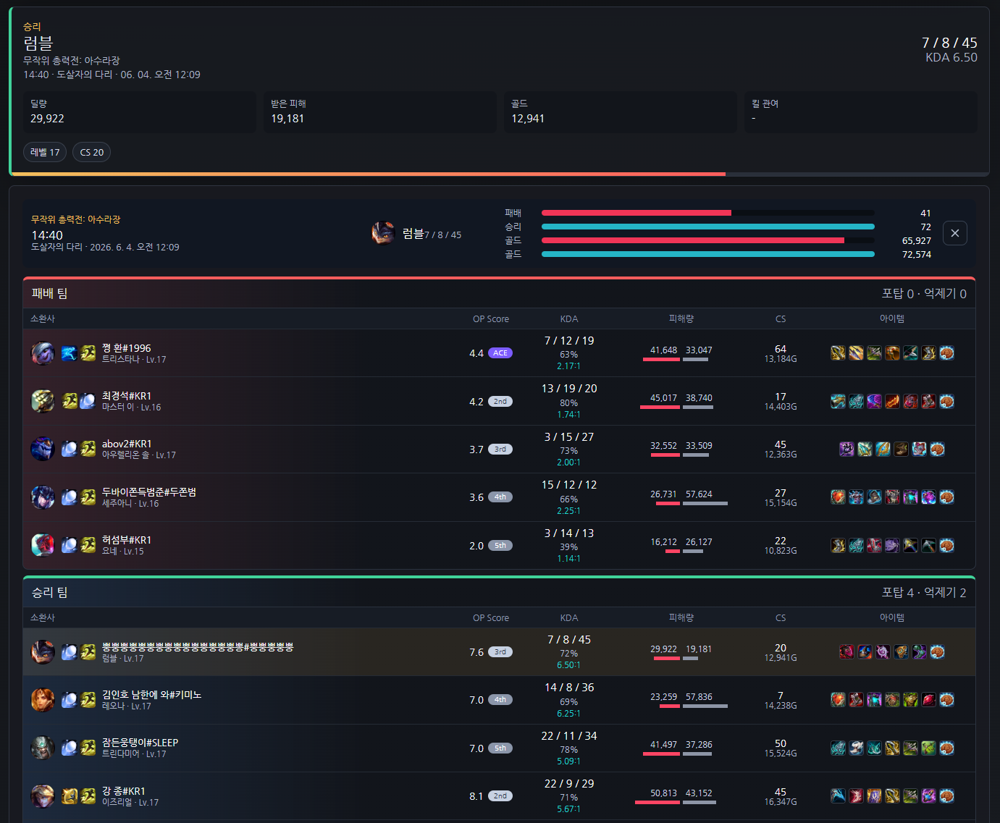
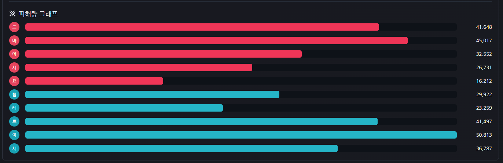

# 아수라장 전적

롤 클라이언트의 로컬 LCU API를 읽어서 `무작위 총력전: 아수라장` 전적을 보여주는 실험용 전적 사이트입니다.

## 미리보기







## 실행

```powershell
npm install
npm run dev -- --port 5173
```

브라우저에서 `http://localhost:5173`으로 접속합니다.

## 중요

- 롤 클라이언트가 켜져 있어야 클라이언트 전적을 가져올 수 있습니다.
- Riot 공식 Match-V5에서는 현재 아수라장 기록이 잡히지 않을 수 있습니다.
- LCU 방식은 사용자의 PC에서 실행 중인 클라이언트의 `lockfile`을 읽어 로컬 API에 접근합니다.
- 클라이언트를 끄면 LCU 조회는 동작하지 않습니다.

## 현재 기능

- 롤 클라이언트 대전 기록에서 `gameMode: KIWI` 경기만 필터링
- 최근 아수라장 경기 목록
- OP.GG 스타일 경기 상세 스코어보드
- 챔피언, 스펠, 아이템 아이콘 표시
- 팀별 킬/골드 비교
- 피해량 그래프
- 챔피언별 성적 다이얼로그

## 개발 메모

공식 Riot API 키는 LCU 전용 흐름에서는 필요하지 않습니다.  
기존 공식 API 실험 경로를 다시 사용할 때만 `.env`에 `RIOT_API_KEY`를 넣으면 됩니다.

```env
RIOT_API_KEY=RGAPI-...
```
